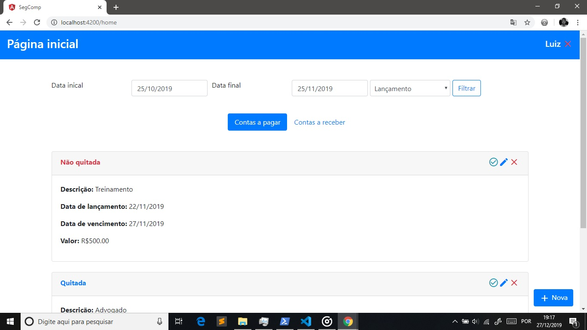
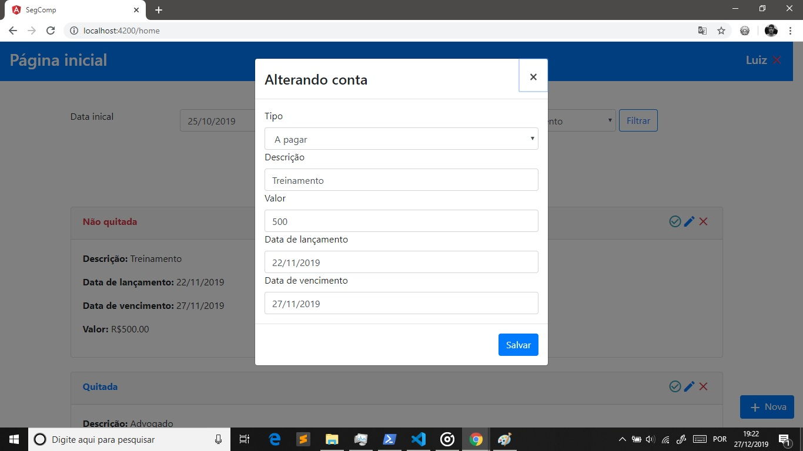

Projeto desenvolvido para as disciplinas de Qualidade de Software II e Segurança Computacional do curso de Computação(8º Período), onde fora solicitado pela professora Camila testes simples de SQL Injection e implementação de testes automatizados simples. Para a execução dos testes de SQL Injection, foi criada uma vunerabilidade intencional no Sequelize, onde é uma *raw query* é utilizada sem filtrar os dados de entrada. Já para os testes automatizados, foi utilizado o Test Runner **Karma** e o framework **Jasmine**.  

#### Passo a passo de execução

##### Banco de dados
Por utilizar o ORM Sequelize, nesta aplicação não é necessário modelar um banco de dados, mas somente criá-lo com o nome informado no
arquivo *"env.conf.js"* do servidor Node, neste caso *"seg_qual"*. Também é necessário alterar os dados de autenticação do banco de dados 
MySQL no mesmo arquivo mencionado. 

##### Servidor Node
Opção 1: Executar o comando **npm run server** no terminal. Por esta opção, o servidor iniciará a partir do Nodemon, sendo assim,
toda alteração no código fonte será automaticamente executada ao salvar o arquivo.

Opção 2: Executar o comando **node app/index.js**. Roda o servidor da maneira usual.

##### Aplicação Anuglar
Executar o comando **ng serve --open** no terminal.

#### Capturas de tela 

